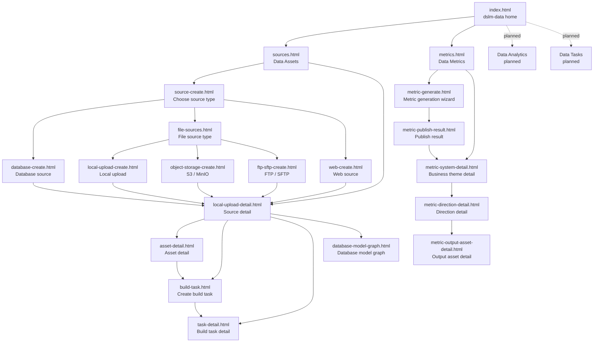

# Page Route Map

The prototype is organized around the home page, Data Assets, and Data Metrics. Data Analytics and Data Tasks are visible on the home page as planned modules only.

## Route Groups

- Home: module-level overview and entry cards.
- Data Assets: source onboarding, source detail, asset detail, build task lifecycle, artifacts, changes, and database model graph.
- Data Metrics: metrics overview, problem-driven generation wizard, publish result, business theme detail, direction detail, and output asset detail.
